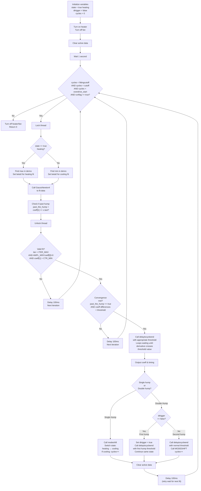

```mermaid
flowchart TD
    A["Initialize variables<br/>state = true heating<br/>dtrigger = false<br/>cycles = 0"] --> B["Turn on heater<br/>Turn off fan"]
    B --> C["Clear active data"]
    C --> D["Wait 1 second"]
    D --> E{"cycles < fittingcutoff<br/>AND cycles < cutoff<br/>AND cycles < overdrive_start<br/>AND runflag == true?"}
    
    E -->|No| END["Turn off heater/fan<br/>Return 0"]
    
    E -->|Yes| F["Lock thread"]
    F --> G{"state == true<br/>heating?"}
    
    G -->|Yes| G1["Find max in derivs<br/>Set beta0 for heating fit"]
    G -->|No| G2["Find min in derivs<br/>Set beta0 for cooling fit"]
    
    G1 --> H["Call GaussNewton4<br/>to fit data"]
    G2 --> H
    
    H --> I["Check if past hump:<br/>past_the_hump =<br/>coeff[1] <= x.last?"]
    I --> J["Unlock thread"]
    
    J --> K{"Valid fit?<br/>iter < ITER_MAX<br/>AND AMPL_MIN*coeff[0]>0<br/>AND coeff[1] > CTR_MIN"}
    
    K -->|No| K1["Delay 100ms<br/>Next iteration"]
    K1 --> E
    
    K -->|Yes| L{"Convergence<br/>met?<br/>past_the_hump == true<br/>AND coeff differences<br/>< threshold"}
    
    L -->|No| L1["Delay 100ms<br/>Next iteration"]
    L1 --> E
    
    L -->|Yes| M["Call delaytocycleend<br/>with appropriate threshold<br/>Loops waiting until:<br/>derivative crosses<br/>threshold value"]
    
    M --> N["Output coeff & timing"]
    N --> O{"Single hump<br/>or<br/>Double hump?"}
    
    O -->|Single Hump| O1["Call modeshift<br/>Switch state:<br/>heating ↔ cooling<br/>If cooling: cycles++"]
    
    O -->|Double Hump| O2{"dtrigger<br/>== false?"}
    
    O2 -->|Yes<br/>First hump| O3["Set dtrigger = true<br/>Call delaytocycleend<br/>with first hump threshold<br/>Continue same state"]
    
    O2 -->|No<br/>Second hump| O4["Call delaytocycleend<br/>with normal threshold<br/>Call MODESHIFT<br/>cycles++"]
    
    O1 --> P["Clear active data"]
    O3 --> P
    O4 --> P
    
    P --> Q["Delay 100ms<br/>(retry wait for next fit)"]
    Q --> E
```
