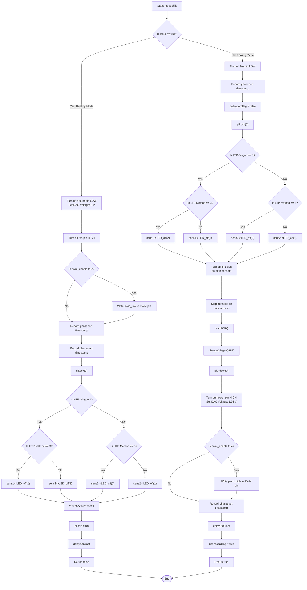

```mermaid
flowchart TD
    Start["Start: modeshift"] --> Check{Is state == true?}
    
    Check -->|Yes: Heating Mode| HeaterOff["Turn off heater pin LOW<br/>Set DAC Voltage: 0 V"]
    Check -->|No: Cooling Mode| FanOff["Turn off fan pin LOW"]
    
    HeaterOff --> FanOn["Turn on fan pin HIGH"]
    FanOn --> PWMCheck1{Is pwm_enable true?}
    PWMCheck1 -->|Yes| PWMLow["Write pwm_low to PWM pin"]
    PWMCheck1 -->|No| PhaseEnd1["Record phaseend timestamp"]
    PWMLow --> PhaseEnd1
    PhaseEnd1 --> PhaseStart1["Record phasestart timestamp"]
    PhaseStart1 --> PiLock1["piLock(0)"]
    PiLock1 --> HTPCheck{Is HTP Qiagen 1?}
    
    HTPCheck -->|Yes| HTP1Check{Is HTP Method == 3?}
    HTPCheck -->|No| HTP2Check{Is HTP Method == 3?}
    
    HTP1Check -->|Yes| LEDOff1["sens1->LED_off(2)"]
    HTP1Check -->|No| LEDOff2["sens1->LED_off(1)"]
    HTP2Check -->|Yes| LEDOff3["sens2->LED_off(2)"]
    HTP2Check -->|No| LEDOff4["sens2->LED_off(1)"]
    
    LEDOff1 --> ChangeQiagen1["changeQiagen(LTP)"]
    LEDOff2 --> ChangeQiagen1
    LEDOff3 --> ChangeQiagen1
    LEDOff4 --> ChangeQiagen1
    
    ChangeQiagen1 --> PiUnlock1["piUnlock(0)"]
    PiUnlock1 --> Delay1["delay(500ms)"]
    Delay1 --> Return1["Return false"]
    
    FanOff --> PhaseEnd2["Record phaseend timestamp"]
    PhaseEnd2 --> RecordFlag["Set recordflag = false"]
    RecordFlag --> PiLock2["piLock(0)"]
    PiLock2 --> LTPCheck1{Is LTP Qiagen == 1?}
    
    LTPCheck1 -->|Yes| LTP2Check{Is LTP Method == 3?}
    LTPCheck1 -->|No| LTP2Check2{Is LTP Method == 3?}
    
    LTP2Check -->|Yes| LEDOff5["sens1->LED_off(2)"]
    LTP2Check -->|No| LEDOff6["sens1->LED_off(1)"]
    LTP2Check2 -->|Yes| LEDOff7["sens2->LED_off(2)"]
    LTP2Check2 -->|No| LEDOff8["sens2->LED_off(1)"]
    
    LEDOff5 --> TurnOffAll["Turn off all LEDs<br/>on both sensors"]
    LEDOff6 --> TurnOffAll
    LEDOff7 --> TurnOffAll
    LEDOff8 --> TurnOffAll
    
    TurnOffAll --> StopMethods["Stop methods on<br/>both sensors"]
    StopMethods --> ReadPCR["readPCR()"]
    ReadPCR --> ChangeQiagen2["changeQiagen(HTP)"]
    ChangeQiagen2 --> PiUnlock2["piUnlock(0)"]
    PiUnlock2 --> HeaterOn["Turn on heater pin HIGH<br/>Set DAC Voltage: 1.95 V"]
    HeaterOn --> PWMCheck2{Is pwm_enable true?}
    PWMCheck2 -->|Yes| PWMHigh["Write pwm_high to PWM pin"]
    PWMCheck2 -->|No| PhaseStart2["Record phasestart timestamp"]
    PWMHigh --> PhaseStart2
    PhaseStart2 --> Delay2["delay(500ms)"]
    Delay2 --> RecordTrue["Set recordflag = true"]
    RecordTrue --> Return2["Return true"]
    
    Return1 --> End([End])
    Return2 --> End
```
