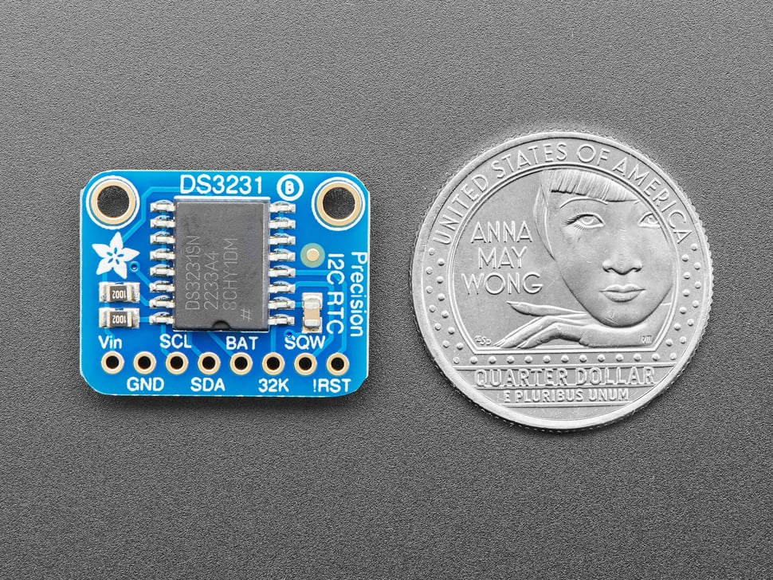
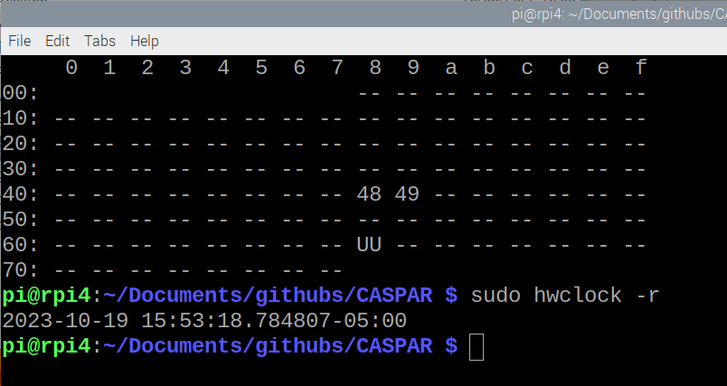

# CASPAR

Have tried to make the setup work from scripts:<br>
<br>
<b>systemSetup.sh</b> should be run on a new SD Drive Raspberry Pi drive.  Should install nodejs, node-gyp, and WiringPi.  Nodejs from https://github.com/nodesource/distributions , then node-gyp, and WiringPi from Nick's github, https://github.com/IceTeaAlchemist/WiringPi .  Likely run once for a new SD Drive / Raspberry Pi configuration.  Set the user defined items at the top of the systemSetup.sh script.

```
######################
#  User defined names.
######################
MYHOSTNAME=rpi3
CURHOSTNAME=`hostname`
NETWORK=CASPAR01
PASSWORD=<some password>
######################
```

```bash
cd ${HOME}/Documents/githubs
git clone https://github.com/IceTeaAlchemist/CASPAR
cd CASPAR
sudo bash ./systemSetup.sh
```

This also does the network setup, for the private wifi network.  Not conistent to have the private network start from the script.  Check the *.conf files were made correctly---see the script commands.  May need to do:<br>

```
sudo systemctl stop hostapd
sudo systemctl stop dnsmasq
sudo systemctl stop dhcpcd
sudo systemctl start hostapd
sudo systemctl start dnsmasq
sudo systemctl start dhcpcd
sudo ifup wlan0
```


<br>
<br>
<b>runSetup.sh</b> should be run after the cloning of CASPAR and running the systemSetup.sh script.  Should be run in the CASPAR directory, or in any new directory that you setup for the CASPAR code.<br>

```bash
sudo bash ./runSetup.sh
node-gyp rebuild    ( or for partial rebuild node-gyp build )
```

<br>
====================================================================<br>
====================================================================<br>
[N.B., older information but maybe useful.  Tried to move the below into the two scripts.]<br>

This is some direction for setup.<br>

First get an Access Token for "git clone" the repo.<br>

Check node is installed, "node -v" and use version 16.<br>
https://github.com/nodesource/distributions <br>
sudo curl -fsSL https://deb.nodesource.com/setup_16.x | sudo bash - <br>
sudo apt-get install -y nodejs <br>
node -v , is now v16.15.1  and we are FIXED on that for now.<br>

<br>
sudo npm install node-gyp<br>

in /githubs/CASPAR:<br>

npm init<br>
npm install every package in 'require' except casparengine<br>
    npm install ws<br>
    npm install nodemailer<br>
    npm install fs<br>
    npm install -g node-gyp<br>
<br>
node-gyp configure
<br>
<br>
node-gyp build<br>
node caspar.js (be sure to create ./data/ directory by hand)<br>
<br>

After updating software, maybe restarting the RPi, we found we needed to restart hostapd and dnsmasq to restart the wifi as access point:<br>
sudo systemctl restart dnsmasq<br>
sudo systemctl restart hostapd<br>
<br>

To have the Download Files button...download files, created several links and an .htaccess file.  The links are:<br>
/var/www/html/data   ->  CASPAR/data<br>
/var/www/html/CASPAR ->  CASPAR<br>
These are in the runSetup.sh script next to the other links.<br>
The .htaccess is pretty simple and it exists in CASPAR and in CASPAR/data<br>
```HTML
<FilesMatch "\.(pdf|html|mp3|zip|bin|txt)$">
     ForceType application/octet-stream
     Header set Content-Disposition attachment
</FilesMatch>
```

## Precision Realtime Clock - Adafruit DS3231 Precision RTC Breakout
See the web page and associated configuration pages at https://www.adafruit.com/product/3013 .  This is an I2C integrated hardware clock with a 
battery backup to it.  Advertised as extremely precise,<br>



Our configuration for the added RTC comes form the page https://learn.adafruit.com/adding-a-real-time-clock-to-raspberry-pi , following 
the "systemd" approach.  In short:<br>
* Connect up the board to power, VCC to 3.3V for DS3231, GND to GND, and I2C SDA and SCL to the RPi's SDA and SCL.  Our auxiliary electronics board
handles these connections.  Make sure there is a battery installed.<br>
* Scan the bus, with 
```
sudo i2cdetect -y 1
```



and should see the device on address 0x68.  On our current system you should also see 0x48 and 0x49 addresses taken by the ADS1115 ADC chips.
On systems where the Kernel driver has been install you will see UU in the 0x68 address place.<br>
* Now to edit the system configuration.  Add the the lines below as the last lines to /boot/config.txt<br>
```
dtoverlay=i2c-rtc,ds3231
```
if using the DS3231 chip.  
* Reboot and then the **i2cdetect -y 1** should see a UU in address 0x68.  And the clock should be working.
* Disable the FAKE hardware clock the Raspberry Pis come with:
```
sudo apt-get -y remove fake-hwclock
sudo update-rc.d -f fake-hwclock remove
sudo systemctl disable fake-hwclock
```
* Edit <code>/lib/udev/hwclock-set</code>, e.g. using nano like **sudo nano /lib/udev/hwclock-set**, and comment out the lines so the final form is
```
#if [ -e /run/systemd/system ] ; then
# exit 0
#fi
```
Also comment out the lines<br>
```
/sbin/hwclock --rtc=$dev --systz --badyear
...
/sbin/hwclock --rtc=$dev --systz
```
* Read the hardware clock with **sudo hwclock -r**.
* Make sure the Raspberry Pi is connected to the internet and the NTP is working.  Once it syncs with the ntpservers, do a write to hwclock,
```
sudo hwclock -w
```
Now the RPi and the hardware clock are synchronized.  And the hwclock should be the "master" of time.


This contains the current, weekly updated version of the CASPAR device code until someone makes me change the name.
